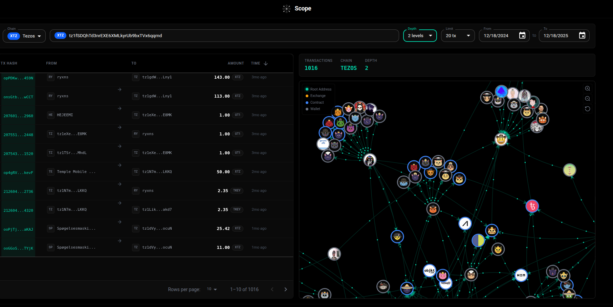

# Scope



## Description

**Scope** est un outil de visualisation de transactions blockchain sous forme de graphe interactif en 3D. Il permet d'explorer et d'analyser les flux de transactions entre différentes adresses de portefeuilles crypto.

### Fonctionnalités

- **Visualisation en graphe 3D** : Les transactions sont représentées sous forme de nœuds et de liens interactifs
- **Multi-chain** : Support de plusieurs blockchains (Tezos, Ethereum, etc.)
- **Filtrage avancé** : Filtrez par période, profondeur d'exploration et nombre de transactions
- **Liste des transactions** : Consultez le détail de chaque transaction dans un tableau
- **Navigation intuitive** : Cliquez sur un nœud pour explorer ses connexions

### Cas d'usage

- Analyse de l'activité d'un portefeuille
- Traçage des flux de fonds entre adresses
- Identification des patterns de transactions
- Audit et investigation blockchain

---

## Getting Started

First, run the development server:

```bash
npm run dev
# or
yarn dev
```

Open [http://localhost:3000](http://localhost:3000) with your browser to see the result.

You can start editing the page by modifying `pages/index.js`. The page auto-updates as you edit the file.

[API routes](https://nextjs.org/docs/api-routes/introduction) can be accessed on [http://localhost:3000/api/hello](http://localhost:3000/api/hello). This endpoint can be edited in `pages/api/hello.js`.

The `pages/api` directory is mapped to `/api/*`. Files in this directory are treated as [API routes](https://nextjs.org/docs/api-routes/introduction) instead of React pages.

This project uses [`next/font`](https://nextjs.org/docs/basic-features/font-optimization) to automatically optimize and load Inter, a custom Google Font.

## Learn More

To learn more about Next.js, take a look at the following resources:

- [Next.js Documentation](https://nextjs.org/docs) - learn about Next.js features and API.
- [Learn Next.js](https://nextjs.org/learn) - an interactive Next.js tutorial.

You can check out [the Next.js GitHub repository](https://github.com/vercel/next.js/) - your feedback and contributions are welcome!

## Deploy on Vercel

The easiest way to deploy your Next.js app is to use the [Vercel Platform](https://vercel.com/new?utm_medium=default-template&filter=next.js&utm_source=create-next-app&utm_campaign=create-next-app-readme) from the creators of Next.js.

Check out our [Next.js deployment documentation](https://nextjs.org/docs/deployment) for more details.
